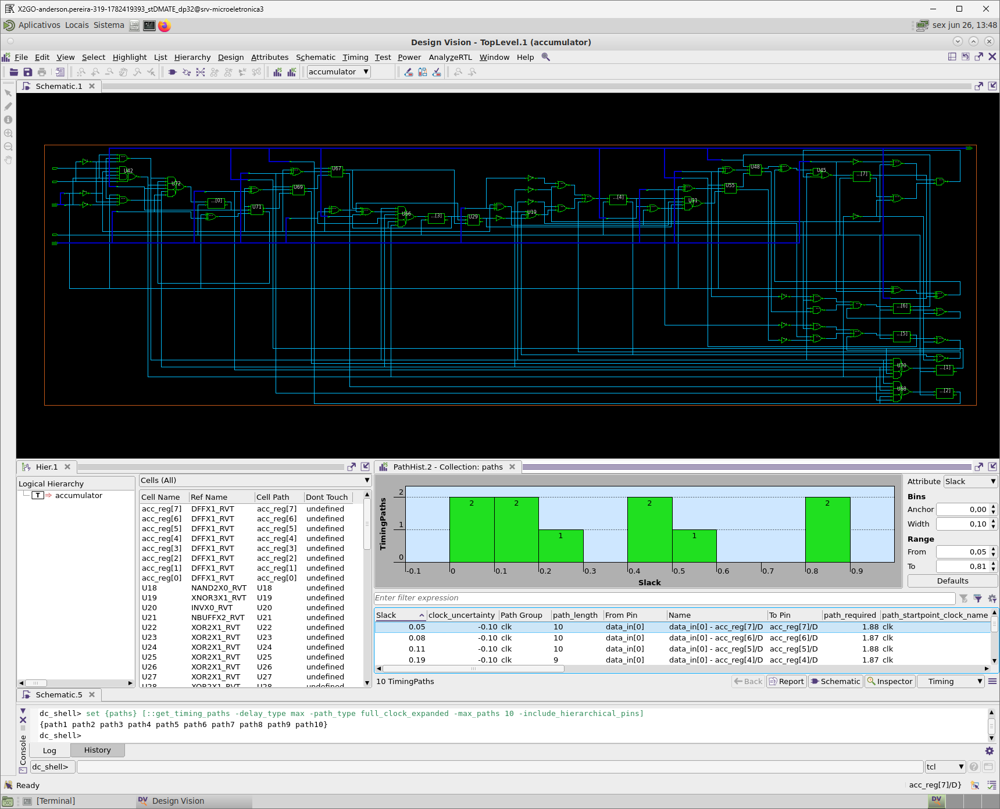
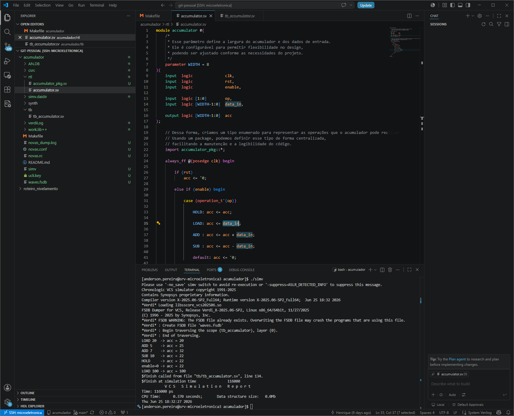
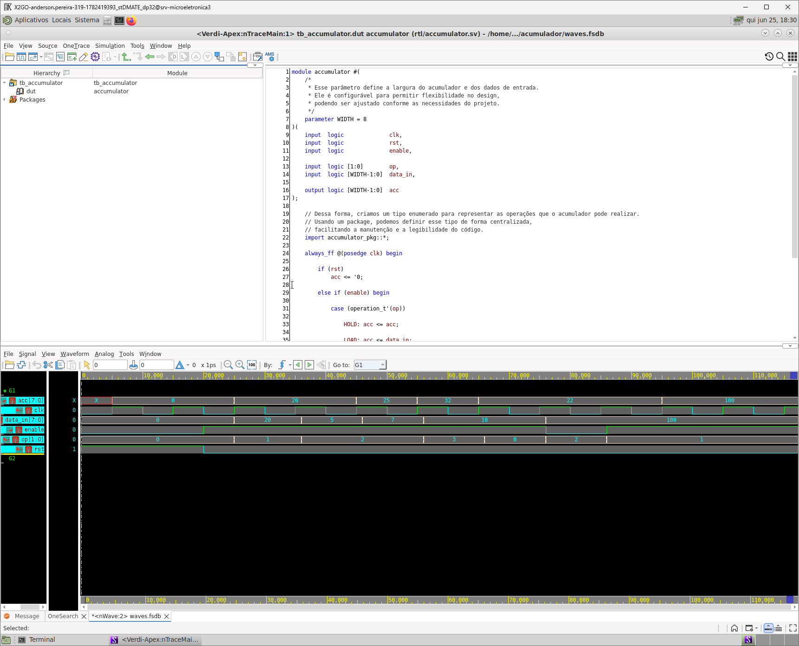
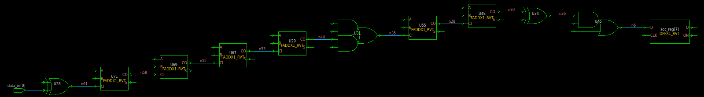

# Projeto de um Acumulador Sequencial em SystemVerilog

## Descrição do Projeto

Nesta atividade, será analisado um circuito sequencial denominado **acumulador**. Diferentemente de circuitos combinacionais, cujo comportamento depende apenas das entradas atuais, circuitos sequenciais possuem memória; portanto, sua saída também depende do histórico de entradas e do estado interno armazenado.

O acumulador possui um registrador interno com largura parametrizável (`WIDTH`), responsável por armazenar um valor. A cada borda de subida do clock, esse valor é atualizado de acordo com o código de operação selecionado.

As operações disponíveis são:

| Operação | Código | Descrição |
| --- | --- | --- |
| **HOLD** | 00 | Mantém o valor atual do acumulador |
| **LOAD** | 01 | Carrega o valor presente em `data_in` |
| **ADD** | 10 | Soma `data_in` ao valor armazenado |
| **SUB** | 11 | Subtrai `data_in` do valor armazenado |

Além disso, o circuito possui:

* Um sinal de reset síncrono (`rst`) que inicializa o acumulador com zero;
* Um sinal de habilitação (`enable`) que permite ou impede a atualização do registrador;
* Uma saída (`acc`) correspondente ao conteúdo atual do acumulador.

Após baixar o projeto, ele deverá ser:

1. Simulado funcionalmente utilizando VCS;
2. Visualizado utilizando Verdi;
3. Sintetizado no Synopsys Design Compiler;
4. Analisado por meio dos relatórios de área, timing e potência.

O projeto pode ser baixado aqui.

> **ATENÇÃO!** ANTES DE SINTETIZAR, LEMBREM DE COPIAR A PASTA `LIB` DO PROJETO ANTERIOR (ULA, POR EXEMPLO) E EVITEM COLOCAR ESSA LIB DO DESIGN KIT EM REPOSITÓRIOS DO GITHUB!!

---

# Análise da Simulação

O circuito sintetizado está representado a seguir:


<center></center>


---

### 1. Compare as formas de onda obtidas no Verdi com os valores impressos pelo testbench. Eles são consistentes? Gere evidências com prints de que isso é verdade.

**Resposta:**
Evidências geradas com as imagens abaixo. Os valores impressos pelo testbench e as formas de onda capturadas no Verdi apresentam total consistência entre si.

<center> </center>

### 2. Em que instante o reset deixa de atuar sobre o circuito?

**Resposta:**
Como visto nas simulações e no RTL, o `rst` é ativo em nível alto, logo ele deixa de atuar quando passa para o nível baixo. Por se tratar de um reset síncrono, a desativação ou ativação do efeito do reset só terá impacto na saída após a ocorrência de uma borda de subida do clock (`clk`).

### 3. Quantos ciclos de clock são necessários para que uma operação seja efetivamente refletida na saída?

**Resposta:**
O circuito realiza as operações em exatamente **1 ciclo de clock**. Nas simulações, pode parecer haver uma leve inconsistência temporal devido ao fato de as atualizações dos estímulos de entrada do DUT não estarem perfeitamente sincronizadas com a borda do clock no ambiente de teste.

### 4. O valor da saída muda quando `enable = 0`? Justifique.

**Resposta:**
Não muda. Por se tratar de elementos de memória implementados com flip-flops (`always_ff`) e devido à lógica descrita no RTL, o valor é mantido de forma segura (sem inferência indesejada de *latch*), mesmo quando o bloco correspondente ao `else` do condicional `if (enable) begin` não está explicitamente definido.

---

# Análise da Síntese

### 1. Qual é a área total ocupada pelo circuito após a síntese?

**Resposta:**
A área total absoluta das células é de **216.2765 $\mu m^2$** (e a área total incluindo interconexões é de **243.0533 $\mu m^2$**).

```text
****************************************
Report : area
Design : accumulator
Version: X-2025.06-SP2
Date   : Thu Jun 25 19:08:20 2026
****************************************

Information: Updating design information... (UID-85)
Library(s) Used:
    saed32rvt_tt1p05v25c (File: /home/anderson.pereira/CIExpert/git-pessoal/acumulador/libs/saed32rvt_tt1p05v25c.db)

Number of ports:                           21
Number of nets:                            85
Number of cells:                           63
Number of combinational cells:             55
Number of sequential cells:                 8
Number of macros/black boxes:              0
Number of buf/inv:                         12
Number of references:                      18

Combinational area:                163.414591
Buf/Inv area:                       16.011072
Noncombinational area:              52.861954
Macro/Black Box area:                0.000000
Net Interconnect area:              26.776792

Total cell area:                   216.276545
Total area:                        243.053337

Hierarchical area distribution
------------------------------

                                    Global cell area        Local cell area
                                    ------------------  --------------------------- 
Hierarchical cell                 Absolute   Percent  Combi-    Noncombi-  Black-
                                   Total      Total    national  national   boxes   Design
--------------------------------  ---------  -------  --------  ---------  ------  ---------
accumulator                        216.2765    100.0  163.4146    52.8620  0.0000  accumulator
--------------------------------  ---------  -------  --------  ---------  ------  ---------
Total                                                 163.4146    52.8620  0.0000

1

```

### 2. Qual é o caminho crítico identificado pelo relatório de timing?

**Resposta:**
O caminho crítico inicia na porta de entrada `data_in[0]` e termina no flip-flop `acc_reg[7]`. O menor *slack* (margem de tempo) apresentado foi de **0.05 ns** (atendendo às restrições temporais).

```text
****************************************
Report : timing
        -path full
        -delay max
        -max_paths 10
Design : accumulator
Version: X-2025.06-SP2
Date   : Fri Jun 26 11:46:01 2026
****************************************

Operating Conditions: tt1p05v25c    Library: saed32rvt_tt1p05v25c
Wire Load Model Mode: enclosed

Startpoint: data_in[0] (input port clocked by clk)
Endpoint: acc_reg[7] (rising edge-triggered flip-flop clocked by clk)
Path Group: clk
Path Type: max

Des/Clust/Port     Wire Load Model       Library
------------------------------------------------
accumulator        8000                  saed32rvt_tt1p05v25c

Point                                                   Incr       Path
---------------------------------------------------------------------------
clock clk (rise edge)                                   0.00       0.00
clock network delay (ideal)                             0.00       0.00
input external delay                                    1.00       1.00 f
data_in[0] (in)                                         0.00       1.00 f
U28/Y (XOR2X1_RVT)                                      0.09       1.09 r
U71/CO (FADDX1_RVT)                                     0.09       1.18 r
U69/CO (FADDX1_RVT)                                     0.09       1.27 r
U67/CO (FADDX1_RVT)                                     0.10       1.36 r
U29/CO (FADDX1_RVT)                                     0.09       1.45 r
U31/Y (AO22X1_RVT)                                      0.06       1.51 r
U55/CO (FADDX1_RVT)                                     0.09       1.60 r
U48/CO (FADDX1_RVT)                                     0.08       1.68 r
U34/Y (XOR2X1_RVT)                                      0.08       1.76 f
U45/Y (AO21X1_RVT)                                      0.05       1.82 f
acc_reg[7]/D (DFFX1_RVT)                                0.01       1.83 f
data arrival time                                                  1.83

clock clk (rise edge)                                   2.00       2.00
clock network delay (ideal)                             0.00       2.00
clock uncertainty                                      -0.10       1.90
acc_reg[7]/CLK (DFFX1_RVT)                              0.00       1.90 r
library setup time                                     -0.02       1.88
data required time                                                 1.88
---------------------------------------------------------------------------
data required time                                                 1.88
data arrival time                                                 -1.83
---------------------------------------------------------------------------
slack (MET)                                                        0.05

```

### 3. Por quais elementos do circuito o caminho crítico passa?

**Resposta:**
O caminho crítico passa sequencialmente pelos seguintes elementos lógicos de passagem (portas lógicas e somadores completos):

```text
data_in[0] (in)                                         0.00       1.00 f
U28/Y (XOR2X1_RVT)                                      0.09       1.09 r
U71/CO (FADDX1_RVT)                                     0.09       1.18 r
U69/CO (FADDX1_RVT)                                     0.09       1.27 r
U67/CO (FADDX1_RVT)                                     0.10       1.36 r
U29/CO (FADDX1_RVT)                                     0.09       1.45 r
U31/Y (AO22X1_RVT)                                      0.06       1.51 r
U55/CO (FADDX1_RVT)                                     0.09       1.60 r
U48/CO (FADDX1_RVT)                                     0.08       1.68 r
U34/Y (XOR2X1_RVT)                                      0.08       1.76 f
U45/Y (AO21X1_RVT)                                      0.05       1.82 f
acc_reg[7]/D (DFFX1_RVT)                                0.01       1.83 f

```

<center></center>

### 4. Existem violações de setup ou hold? Caso existam, em quais condições elas ocorrem?

**Resposta:**
**Não há violações** de tempo no circuito sob as restrições atuais, conforme indica o relatório de restrições do Design Compiler.

```text
****************************************
Report : constraint
        -all_violators
Design : accumulator
Version: X-2025.06-SP2
Date   : Fri Jun 26 13:27:43 2026
****************************************

This design has no violated constraints.

```

### 5. Qual é a potência estimada do circuito?

**Resposta:**
A potência total estimada para o circuito é de **63.0201 $\mu W$**.

```text
                                Internal         Switching           Leakage            Total
Power Group      Power            Power               Power              Power   (   %    )  Attrs
--------------------------------------------------------------------------------------------------
io_pad             0.0000            0.0000            0.0000            0.0000  (   0.00%)
memory             0.0000            0.0000            0.0000            0.0000  (   0.00%)
black_box          0.0000            0.0000            0.0000            0.0000  (   0.00%)
clock_network     26.0600            0.0000            0.0000           26.0600  (  41.35%)  i
register           1.8631            0.5515        8.6895e+06           11.1041  (  17.62%)
sequential         0.0000            0.0000            0.0000            0.0000  (   0.00%)
combinational     10.6196            2.8105        1.2426e+07           25.8560  (  41.03%)
--------------------------------------------------------------------------------------------------
Total             38.5427 uW         3.3620 uW     2.1115e+07 pW        63.0201 uW

```

### 6. Qual é a contribuição relativa dos flip-flops e da lógica combinacional para a área total?

**Resposta:**
Com base no relatório de área obtido na Questão 1:

* **Área não combinacional (Flip-Flops):** $52.861954 \ \mu m^2$
* **Área total de células (Total cell area):** $216.276545 \ \mu m^2$

Considerando que não há *latches* inferidos no circuito, a contribuição percentual dos flip-flops é calculada da seguinte forma:

$$\text{Contribuição} = \left(\frac{52.8620}{216.2765}\right) \times 100 \approx \mathbf{24.44\%}$$

Consequentemente, a lógica combinacional pura e buffers/inversores respondem por aproximadamente **75.56%** da área total de células do bloco.

---

# Propostas de Atividades

### Atividade 1 – Alteração da frequência de operação

Modifique o período do clock no arquivo de constraints para: 20 ns, 10 ns, 5 ns, 2 ns e 1 ns. Para cada caso, registre o *slack* obtido, identifique a presença de violações de *setup* e determine, aproximadamente, a frequência máxima do circuito.

#### Respostas:

Os valores de *slack* apresentados referem-se aos piores casos estruturais. O cálculo da frequência máxima ($F_{\text{MAX}}$) considera a latência externa de entrada de 1.0 ns (`set_input_delay 1.0 ...`) configurada no script:

$$F_{\text{MAX}} = \frac{1}{T_{\text{min}}} = \frac{1}{T_{\text{CLK}} - \text{Slack}}$$

| Período ($T_{\text{CLK}}$) | Slack (Pior Caso) | Presença de Violações | Freq. Máxima (Aprox.) |
| --- | --- | --- | --- |
| **20 ns** | +17.99 ns | Sem violações | 497.5 MHz |
| **10 ns** | +7.89 ns | Sem violações | 473.9 MHz |
| **5 ns** | +2.89 ns | Sem violações | 473.9 MHz |
| **2 ns** | +0.00 ns | Sem violações | 500.0 MHz |
| **1 ns** | -1.09 ns | **max_delay/setup VIOLATED** | 478.5 MHz |

**Log de Violações de Restrição Temporais para o período de 1 ns:**

```text
****************************************
Report : constraint
        -all_violators
Design : accumulator
Version: X-2025.06-SP2
Date   : Fri Jun 26 15:12:20 2026
****************************************

   max_delay/setup ('clk' group)

                        Required      Actual
   Endpoint            Path Delay    Path Delay        Slack
   -----------------------------------------------------------------
   acc_reg[7]/D                 0.87           1.97 f        -1.09  (VIOLATED)
   acc_reg[6]/D                 0.88           1.97 f        -1.09  (VIOLATED)
   acc_reg[5]/D                 0.88           1.88 f        -1.00  (VIOLATED)
   acc_reg[4]/D                 0.88           1.80 f        -0.92  (VIOLATED)
   acc_reg[3]/D                 0.88           1.71 f        -0.83  (VIOLATED)
   acc_reg[2]/D                 0.88           1.62 f        -0.74  (VIOLATED)
   acc_reg[1]/D                 0.88           1.53 f        -0.65  (VIOLATED)
   acc_reg[0]/D                 0.87           1.44 r        -0.57  (VIOLATED)
   acc[1]                      -0.10           0.09 f        -0.19  (VIOLATED)
   acc[2]                      -0.10           0.09 f        -0.19  (VIOLATED)
   acc[3]                      -0.10           0.09 f        -0.19  (VIOLATED)
   acc[4]                      -0.10           0.09 f        -0.19  (VIOLATED)
   acc[5]                      -0.10           0.09 f        -0.19  (VIOLATED)
   acc[6]                      -0.10           0.09 f        -0.19  (VIOLATED)
   acc[0]                      -0.10           0.09 f        -0.19  (VIOLATED)
   acc[7]                      -0.10           0.09 f        -0.19  (VIOLATED)

```

---

### Atividade 2 – Alteração da largura do registrador

Repita a síntese para `WIDTH = 8`, `WIDTH = 16` e `WIDTH = 32`. Compare a área, a potência e o atraso do caminho crítico, explicando as diferenças observadas.

#### Respostas:

Os dados foram consolidados utilizando um clock de referência de 500 MHz (`create_clock -name clk -period 2 [get_ports clk]`).

| WIDTH | Área Total | Potência Total | Atraso do Caminho Crítico |
| --- | --- | --- | --- |
| **8** | 243.05 $\mu m^2$ | 63.0201 $\mu W$ | 1.83 ns |
| **16** | 595.98 $\mu m^2$ | 135.1490 $\mu W$ | 1.87 ns |
| **32** | 1295.88 $\mu m^2$ | 278.7504 $\mu W$ | 1.86 ns |

**Explicação das Diferenças:**
Como o tempo de atraso máximo está operando praticamente no limite físico da tecnologia para essa restrição específica de restrição temporal ($Slack \approx 0$), o Design Compiler (DC) realiza otimizações estruturais pesadas modificando a topologia lógica para conseguir fechar o *timing*, mantendo os valores de atraso do caminho crítico próximos e estáveis mesmo com barramentos maiores. Em contrapartida, a **área ocupada** e a **potência consumida** escalam de forma proporcional e expressiva, dado o aumento direto no número de flip-flops e na complexidade da lógica combinacional necessária para processar os barramentos de dados expandidos.

---

### Atividade 3 – Inclusão de uma nova operação

Adicione uma nova operação `MULT = 2'b100` que multiplica o conteúdo do acumulador por `data_in`. responda aos impactos gerados no circuito.

#### Respostas:

* **O número de bits do opcode precisou ser alterado?**
Sim, o número de bits do opcode obrigatoriamente precisou ser expandido. Anteriormente, 4 operações eram mapeadas perfeitamente em 2 bits ($ \log_2(4) = 2 $). Ao introduzir uma 5ª operação, tornou-se imperativo adotar um bit extra para a codificação das instruções, passando o barramento de controle para 3 bits.
* **Houve aumento da área?**
Sim. A inclusão de um bloco multiplicador de hardware causou um forte impacto na área total do circuito, que saltou de **$243.05 \ \mu m^2$** para **$613.19 \ \mu m^2$** (mantendo `WIDTH=8`).
* **O caminho crítico se tornou maior?**
Devido às fortes restrições temporais impostas ao compilador, o Design Compiler reorganizou intensamente as estruturas internas para manter o circuito funcional no limite exigido. Dessa forma, o atraso se estabilizou em **1.87 ns** ($Slack = 0$).
* **A potência sofreu alteração?**
Sim, a potência total estimada teve um incremento considerável, elevando-se para **93.4360 $\mu W$** contra os 63.0201 $\mu W$ registrados originalmente no design base com largura de 8 bits.

---

### Atividade 4 – Saturação

Modifique o circuito para implementar aritmética saturada. Se a soma estourar o limite máximo representável, armazene o valor máximo. Se a subtração resultar em um valor negativo, armazene zero. Analise o impacto sobre área, timing e potência.

#### Respostas:

Para fins de comparação justa, foi tomado como ponto de partida o circuito construído na atividade anterior (com a operação de multiplicação inclusa).

| Variação do Circuito | Área Total | Potência Total | Atraso Máximo |
| --- | --- | --- | --- |
| **Acumulador Normal (Com MULT)** | 613.19 $\mu m^2$ | 63.0201 $\mu W$ | 1.87 ns |
| **Acumulador Saturado (Com MULT)** | 1135.10 $\mu m^2$ | 129.2334 $\mu W$ | 1.87 ns |

**Análise de Impacto:**
A inclusão de lógica de saturação exige a inserção de comparadores e multiplexadores extras no caminho de dados para checar condições de *underflow* e *overflow* antes de atualizar o registrador. Esse hardware adicional praticamente **dobrou a área ocupada** e a **potência consumida** do design. O atraso foi mantido no limite de 1.87 ns graças aos esforços de otimização de síntese direcionados pela ferramenta para cumprimento dos requisitos temporais estabelecidos.